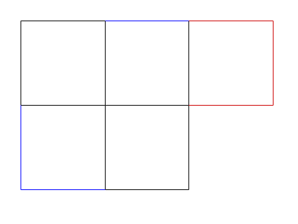

# Toothpicks

A waitress lays out 12 toothpicks as shown below:

And challenges you to create 5 squares by only moving 3 of the toothpicks.
After some thinking you come to the following conclusion (where red toothpicks
were moved to the blue spots).

Amazed at your cleverness, the waitress tests you again, "Okay, smartypants!
How many toothpicks would you need to make a billion squares?!". You reply
(somewhat condescendingly <jerk>), "I can do better than that. How about I write
a program that can find the minimum number of toothpicks needed for any number
of squares."

------------------------

## Input Format
1. The first line is the number of test cases `t`
2. The following lines are the number of squares `n`

### Constraints
- 1 < `t` < 100
- 1 < `n` < 1020

### Sample Input
	5
	1
	2
	3
	4
	5

### Sample Output
	4
	7
	10
	12
	12
